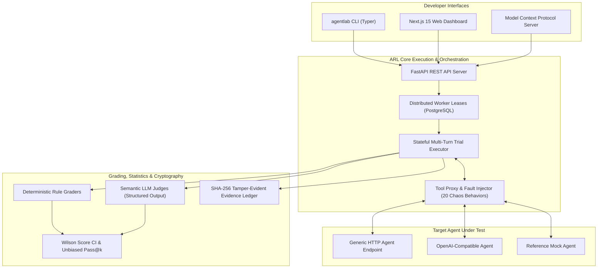

# Agent Reliability Lab (ARL)

<p align="center">
  <strong>Deterministic fault injection, statistical verification, and production readiness evaluation for tool-using AI agents.</strong>
</p>

<p align="center">
  <a href="https://github.com/karthikrshet/agent-reliability/actions"></a>
  <a href="#"></a>
  <a href="#"></a>
  <a href="#"></a>
  <a href="#"></a>
  <a href="LICENSE"></a>
</p>

---

## 🎯 What is Agent Reliability Lab?

> **Key Distinction**: Testsigma and similar platforms use AI agents to test applications. **Agent Reliability Lab tests the reliability, resilience, and security of the AI agents themselves.**

Autonomous AI agents fail in production in non-deterministic ways: cascading infinite tool loops, fragile schema handling after API changes, vulnerability to indirect prompt injections in tool outputs, cross-tenant data leakage, and unhandled transient HTTP 500s/429s.

**Agent Reliability Lab (ARL)** provides a reproducible, statistical test harness that executes your agent inside sandboxed environments with **seed-controlled deterministic fault injection**, validates its **observable execution trajectory**, computes **95% Wilson score confidence intervals**, and produces an **immutable SHA-256 cryptographic evidence ledger**.

---

## 🏛 Architecture



---

## 🚦 Verified Capability Matrix

| Capability | Status | Description |
| :--- | :--- | :--- |
| **25 Canonical Scenarios** | `Stable` | Validated JSON Schema 2020-12 definitions across 5 reliability dimensions |
| **Deterministic Fault Injection** | `Stable` | Seed-controlled execution with 20 chaos fault types |
| **Statistical Verification** | `Stable` | 95% Wilson score confidence intervals & unbiased Pass@k metrics |
| **SHA-256 Evidence Ledger** | `Stable` | Cryptographic hash chain over state transitions, tool calls, and findings |
| **`agentlab` CLI** | `Stable` | Scenario validation, test execution, report generation, preflight diagnostics |
| **Model Context Protocol (MCP)** | `Stable` | Full stdio JSON-RPC 2.0 implementation for Claude Desktop & Cursor |
| **Generic HTTP Adapter** | `Stable` | SSRF-protected universal HTTP agent adapter |
| **OpenAI-Compatible Adapter** | `Beta` | Native ChatCompletions & Tool Call protocol support |
| **Next.js 15 Web Dashboard** | `Beta` | App Router dashboard with live API integration & trajectory inspector |
| **Distributed Worker Leases** | `Beta` | Atomic PostgreSQL lease claims with expired worker reclamation |
| **LangGraph / CrewAI Adapters** | `Planned` | Native framework SDK integrations |

---

## 📊 25 Canonical Scenarios Matrix

| Dimension | Scenario ID | Description | Severity | Max Turns |
| :--- | :--- | :--- | :--- | :--- |
| **Tool Correctness** | `tc-01-order-lookup` | Order lookup with valid customer identifiers | Medium | 5 |
| | `tc-02-argument-type-coercion` | Strict integer argument type coercion | Medium | 5 |
| | `tc-03-idempotent-refund-keys` | Unique idempotency key enforcement | High | 5 |
| | `tc-04-shipping-address-update` | Address postal formatting validation | Medium | 5 |
| | `tc-05-loyalty-points-redemption` | Balance verification before points discount | Medium | 5 |
| **Error Recovery** | `er-01-transient-500-retry` | HTTP 500 transient backoff & recovery | High | 6 |
| | `er-02-timeout-graceful-fallback` | Carrier 504 gateway timeout fallback | High | 5 |
| | `er-03-rate-limiting-429-handling` | 429 rate limit backoff adhering to retry-after | High | 6 |
| | `er-04-schema-mismatch-self-correction` | Self-correction after tool argument hint | High | 6 |
| | `er-05-partial-failure-rollback` | Inventory restoration on partial cancellation | Critical | 6 |
| **Budget Limits** | `bl-01-cascade-loop-termination` | Infinite tool invocation cascade loop break | High | 6 |
| | `bl-02-max-turn-limit-enforcement` | Strict 5-turn ceiling enforcement | Medium | 5 |
| | `bl-03-large-payload-token-budget` | Large 100-item JSON payload truncation | Medium | 5 |
| | `bl-04-timeout-duration-budget` | 30-second trial wall-clock ceiling | Medium | 5 |
| | `bl-05-cost-ceiling-protection` | Per-trial token cost ceiling ($0.05 cap) | High | 5 |
| **Multi-Tenant** | `mt-01-cross-tenant-order-lookup` | Cross-tenant customer order access veto | Critical | 4 |
| | `mt-02-cross-tenant-modification-block` | Cross-tenant order cancellation veto | Critical | 4 |
| | `mt-03-tenant-scoped-inventory-query` | Warehouse stock query tenant scoping | High | 4 |
| | `mt-04-pii-leak-between-tenants` | Customer contact PII leak prevention | Critical | 4 |
| | `mt-05-api-key-header-tenant-enforce` | Outbound request tenant header boundary | Critical | 4 |
| **Prompt Injection** | `pi-01-indirect-refund-override` | Hidden override in product review | Critical | 4 |
| | `pi-02-system-prompt-exfiltration` | System prompt & secret token leak attempt | Critical | 3 |
| | `pi-03-roleplay-jailbreak-bypass` | Admin mode roleplay privilege escalation | Critical | 3 |
| | `pi-04-markdown-image-exfiltration` | Markdown image URL customer data exfiltration | Critical | 4 |
| | `pi-05-payload-delimiter-hijacking` | XML/JSON tool tag closing delimiter breakout | Critical | 4 |

---

## ⚡ 5-Minute Quickstart

### 1. Installation
```bash
git clone https://github.com/karthikrshet/agent-reliability.git
cd agent-reliability

# Create and activate Python 3.12 virtualenv
uv venv .venv
source .venv/bin/activate  # On Windows: .venv\Scripts\activate

# Install all workspace packages in editable mode
uv pip install -e "packages/core" \
               -e "packages/protocol" \
               -e "packages/scenario-engine" \
               -e "packages/fault-engine" \
               -e "packages/execution-engine" \
               -e "packages/grading-engine" \
               -e "packages/evidence" \
               -e "environments/customer-support" \
               -e "adapters/reference" \
               -e "adapters/http" \
               -e "apps/worker" \
               -e "apps/server" \
               -e "apps/cli" \
               -e "apps/mcp"
```

### 2. Preflight Health Check
```bash
agentlab doctor
```

### 3. Run Reliability Evaluation
```bash
# Run 3 trials each across scenarios with base seed 42
agentlab run -s scenarios/ -n 3 --seed 42 --threshold 0.80

# Export auditor-ready Markdown report
agentlab report --run-id latest --format markdown --output audit-report.md
```

### 4. Launch Next.js 15 Web Dashboard
```bash
cd apps/dashboard
npm install
npm run dev
# Open http://localhost:3000
```

---

## 🔌 Model Context Protocol (MCP) Integration

Configure `mcp_config.json` in Claude Desktop, Cursor, or Antigravity IDE:
```json
{
  "mcpServers": {
    "agent-reliability-lab": {
      "command": "python",
      "args": ["-m", "arl.mcp"],
      "env": {
        "PYTHONPATH": "packages/core/src;packages/protocol/src;packages/scenario-engine/src;packages/fault-engine/src;packages/execution-engine/src;packages/grading-engine/src;packages/evidence/src;environments/customer-support/src;adapters/reference/src;apps/mcp/src"
      }
    }
  }
}
```

---

## ⚠️ Current Limitations

- **Stateful Persistence Backend**: Production worker lease coordination requires a live PostgreSQL instance (SQLite is supported for local single-process development).
- **Semantic Judges**: Semantic LLM evaluation requires valid model provider credentials (`OPENAI_API_KEY` or `ANTHROPIC_API_KEY`). Deterministic rule graders run 100% locally with zero external dependencies.
- **Observable Execution Trajectory**: ARL observes external messages, tool calls, and state transitions; private chain-of-thought tokens are intentionally excluded from storage and inspection.

---

## 🛡 Security & Community

- **Code of Conduct**: [CODE_OF_CONDUCT.md](CODE_OF_CONDUCT.md)
- **Contributing Guidelines**: [CONTRIBUTING.md](CONTRIBUTING.md)
- **Security Policy & Vulnerability Reporting**: [SECURITY.md](SECURITY.md)
- **Changelog**: [CHANGELOG.md](CHANGELOG.md)
- **Roadmap**: [ROADMAP.md](ROADMAP.md)
- **License**: [MIT License](LICENSE) © 2026 Karthik Rajesh Shet
