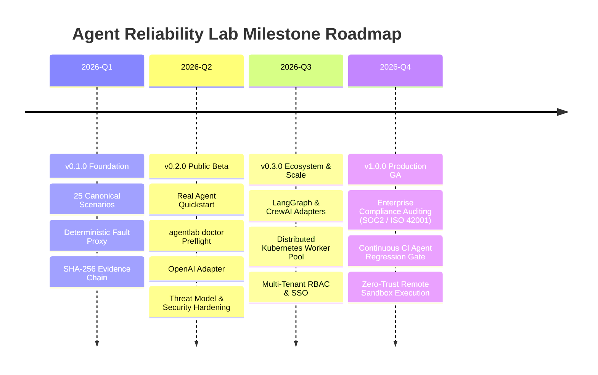

# Agent Reliability Lab (ARL) — Project Roadmap

This document outlines the strategic roadmap and upcoming milestones for **Agent Reliability Lab**.

---

## 📍 Milestone Overview

---

## 🎯 Detailed Milestones

### Milestone 1: v0.1.0 — Foundation (Completed)
- [x] Monorepo structure with `uv` and `pnpm` workspaces.
- [x] Strict state machine with optimistic concurrency locking.
- [x] JSON Schema 2020-12 scenario validation engine.
- [x] 25 Canonical reliability scenarios across 5 core dimensions.
- [x] Deterministic fault injection engine (20 chaos types).
- [x] Immutable cryptographic SHA-256 evidence chain.
- [x] 95% Wilson confidence intervals & unbiased Pass@k metrics.
- [x] `agentlab` CLI, FastAPI REST server, and Next.js 15 Web Dashboard.
- [x] Model Context Protocol (MCP) server over JSON-RPC 2.0 stdio.

### Milestone 2: v0.2.0 — Public Beta (Current)
- [x] Evidence-first repository audit and claim verification.
- [x] `agentlab doctor` preflight diagnostics command.
- [x] 10-minute quickstart with runnable standalone HTTP agent.
- [x] OpenAI-compatible agent adapter with ChatCompletions support.
- [x] Comprehensive threat model and negative security test suite.
- [x] Dashboard empty/loading/error state hardening.
- [x] Strict CI/CD quality pipeline (MyPy, Ruff, Pytest >= 85%, Next.js build).

### Milestone 3: v0.3.0 — Ecosystem & Distributed Scale (Planned)
- [ ] Native framework adapters: LangGraph, CrewAI, AutoGen.
- [ ] Distributed Kubernetes worker execution pool with Redis pub/sub.
- [ ] Real-time Server-Sent Events (SSE) streaming for live trial trajectory logs.
- [ ] Multi-tenant workspace isolation with RBAC and OAuth2/OIDC.
- [ ] Scenario synthesis: AI-assisted scenario authoring from production incident logs.

### Milestone 4: v1.0.0 — Enterprise GA & Compliance (Future)
- [ ] SOC2 & ISO 42001 AI governance compliance report templates.
- [ ] GitHub Actions Agent Regression Gate (fails PRs if agent reliability drops below target Wilson CI).
- [ ] Hardware-isolated microVM sandboxes (Firecracker / gVisor) for arbitrary code execution agents.
