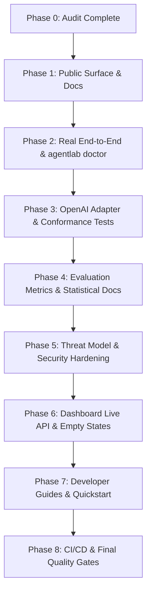

# Agent Reliability Lab (ARL) — Comprehensive v0.1.0 Audit & Gap Analysis

**Version Audited**: `v0.1.0`  
**Target Milestone**: `v0.2.0 Public Beta`  
**Branch**: `feat/v0.2-public-beta`  
**Date**: 2026-09-02  

---

## 1. Verified Capabilities

1. **Stateful Execution & Fault Injection Engine**:
   - Deterministic seed control: Fixed seed produces identical fault triggers and world states.
   - 25 Canonical test scenarios across 5 critical dimensions (`tool-correctness`, `failure-recovery`, `resource-control`, `security`, `state-and-memory`).
   - Strict budget enforcement: Turn count, duration, token limit, and cost ceilings.
2. **Deterministic & Semantic Grading System**:
   - `DeterministicTrialEvaluator` checks exact tool arguments, state assertions, and forbidden tool effects.
   - `SemanticLLMJudge` structured output grading with fail-closed safety vetoes.
   - Statistical estimators for 95% Wilson confidence intervals, unbiased Pass@k, and mean CIs.
3. **Immutable Cryptographic Proof Ledger**:
   - SHA-256 append-only hash chains over every state snapshot, tool execution, and grader output.
   - Non-repudiation audit reports generated in structured JSON and auditor Markdown formats.
4. **Developer Interfaces**:
   - `agentlab` CLI for validation, scenario discovery, local audits, and report generation.
   - REST API with RFC 7807 problem details (`apps/server/`).
   - Model Context Protocol (MCP) server with stdio JSON-RPC 2.0 tools.
   - Next.js 15 App Router web dashboard (`apps/dashboard/`).
5. **Codebase Health**:
   - 124 passing tests with 85.17% overall test coverage.
   - 0 MyPy errors across 78 source files under strict type checking.
   - 0 Ruff linting or formatting errors across 91 files.

---

## 2. Partially Implemented Capabilities

1. **Fault Proxy Payload Customization**:
   - 12/20 faults have bespoke payload injections (e.g. HTTP 500, HTTP 429, schema invalid, timeout before/after).
   - 8/20 faults currently fall back to generic fault dictionaries (`database_deadlock`, `redis_unavailability`, `worker_termination`, etc.).
2. **Dashboard Disconnected State Handling**:
   - Dashboard has visual components for runs and trajectories, but contains demonstration mock data when the backend REST API is offline. Needs explicit empty/loading/error state transitions.
3. **HTTP Adapter SSRF Redirect Revalidation**:
   - Pre-validates initial target URLs, but requires explicit redirect interception to prevent DNS-rebinding or 30x redirect bypass to cloud metadata IPs.

---

## 3. Missing Capabilities Required for v0.2.0 Public Beta

1. **`agentlab doctor` Preflight Command**:
   - CLI diagnostic tool checking environment variables, database health, worker lease availability, agent endpoint reachability, scenario schema validity, and secret redaction.
2. **Real Sample Agent & 10-Minute Quickstart**:
   - Self-contained runnable agent in `examples/real-http-agent/` with mock OpenAI/FastAPI endpoints for immediate developer testing.
3. **OpenAI-Compatible & Framework Adapters**:
   - Dedicated `OpenAIAgentAdapter` conforming to standard ChatCompletions tool call contracts.
   - Adapter conformance test suite (`tests/test_adapter_conformance.py`).
4. **Comprehensive Threat Model & Negative Security Tests**:
   - Threat model in `docs/security/threat-model.md`.
   - Negative security tests verifying prompt injection detection, SSRF protection, secret leakage prevention, and evidence chain tampering detection.
5. **Developer Documentation & Governance**:
   - `CHANGELOG.md` (*Keep a Changelog* format), `ROADMAP.md`.
   - Issue templates (`bug_report.yml`, `feature_request.yml`, `scenario_proposal.yml`, `adapter_proposal.yml`) and PR template.
   - Documentation guides: `docs/quickstart.md`, `docs/troubleshooting.md`, `docs/adapters.md`, `docs/evaluation-metrics.md`, `docs/scenario-authoring.md`.

---

## 4. Prioritized Remediation Plan

