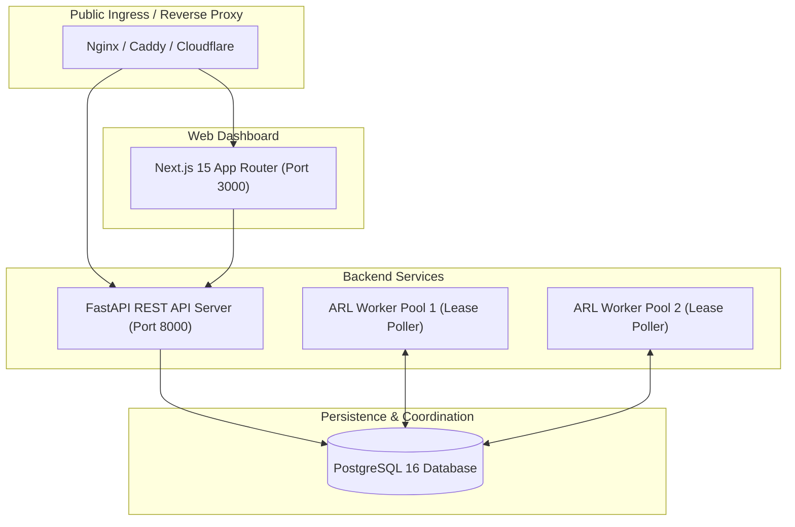

# Agent Reliability Lab — Production Deployment Guide

This guide details how to deploy the Agent Reliability Lab (ARL) server, worker pool, and dashboard in a production environment using Docker and PostgreSQL.

---

## 🏛 Production Architecture



---

## 🐳 Docker Compose Deployment

```yaml
version: "3.8"

services:
  postgres:
    image: postgres:16-alpine
    environment:
      POSTGRES_DB: arl_db
      POSTGRES_USER: arl_user
      POSTGRES_PASSWORD: ${DB_PASSWORD:-secure_dev_password}
    volumes:
      - pgdata:/var/lib/postgresql/data
    ports:
      - "5432:5432"

  server:
    build:
      context: .
      dockerfile: apps/server/Dockerfile
    environment:
      DATABASE_URL: postgresql+asyncpg://arl_user:${DB_PASSWORD:-secure_dev_password}@postgres:5432/arl_db
    ports:
      - "8000:8000"
    depends_on:
      - postgres

  worker:
    build:
      context: .
      dockerfile: apps/worker/Dockerfile
    environment:
      DATABASE_URL: postgresql+asyncpg://arl_user:${DB_PASSWORD:-secure_dev_password}@postgres:5432/arl_db
    depends_on:
      - postgres
      - server

  dashboard:
    build:
      context: apps/dashboard
      dockerfile: Dockerfile
    ports:
      - "3000:3000"
    environment:
      NEXT_PUBLIC_API_URL: http://server:8000

volumes:
  pgdata:
```

---

## 🔐 Production Security Environment Variables

| Variable | Description | Recommended Production Setting |
| :--- | :--- | :--- |
| `DATABASE_URL` | PostgreSQL async connection string | `postgresql+asyncpg://...` with TLS |
| `ARL_ALLOW_LOCALHOST_TARGETS` | Allow probing localhost | `false` (Fail-closed SSRF protection) |
| `OPENAI_API_KEY` | Model provider API key for semantic judging | Redacted via Secret Manager / Vault |
| `ARL_WORKER_LEASE_SECONDS` | Lease timeout duration | `60` |
