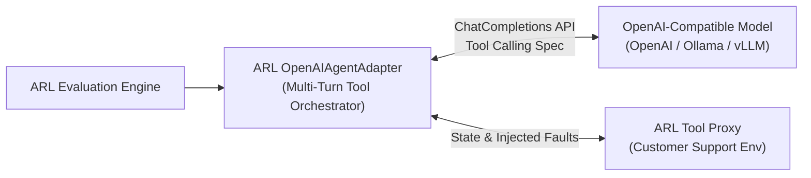

# OpenAI-Compatible Model Evaluation

This example demonstrates how to evaluate real AI models using any OpenAI-compatible API endpoint (including **OpenAI**, **Ollama**, **vLLM**, **LM Studio**, **Groq**, or **Together AI**).

---

## 🏛 Architecture & Scope



> [!NOTE]
> **Architecture Clarification**: The OpenAI-compatible endpoint is a **model endpoint**. ARL's `OpenAIAgentAdapter` manages the agentic loop, tool schema conversion, turn history, and tool result dispatch.

---

## 🔑 Environment Configuration

Set the target model endpoint credentials via environment variables:

```bash
# Standard OpenAI
export ARL_OPENAI_BASE_URL="https://api.openai.com/v1"
export ARL_OPENAI_API_KEY="sk-..."
export ARL_OPENAI_MODEL="gpt-4o-mini"

# Or local Ollama / vLLM
export ARL_OPENAI_BASE_URL="http://127.0.0.1:11434/v1"
export ARL_OPENAI_API_KEY="ollama"
export ARL_OPENAI_MODEL="llama3.1"
```

> [!CAUTION]
> **Security Requirement**: Never commit API keys or credentials to version control.

---

## 🚀 Running an Evaluation

```bash
# Run 3 trials of order lookup against your configured model
agentlab run -s scenarios/tool-correctness/01-order-lookup-correct-arguments.yaml \
             --openai-model "$ARL_OPENAI_MODEL" \
             --openai-base-url "$ARL_OPENAI_BASE_URL" \
             --trials 3 \
             --seed 42 \
             --threshold 0.80
```

---

## 🤖 Automated Demo Runner

Run the programmatic evaluation runner:

```bash
python examples/openai-compatible-agent/run_demo.py
```
If credentials are not set, it will display instructions on configuring OpenAI or Ollama.
